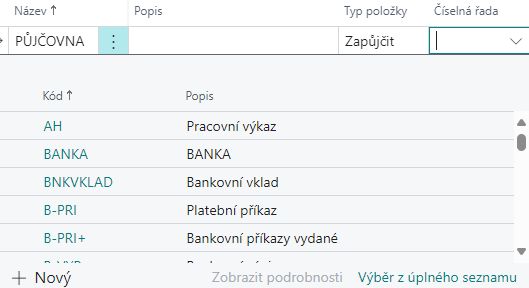
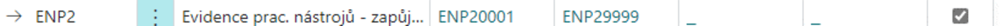

# Evidence nářadí a pomůcek - Nastavení
> Aktualizace: 01.12.2024

 Modul **Evidence nářadí a pomůcek** řeší problematiku evidence nářadí, pomůcek, nástrojů, forem a jiných potřeb obvykle evidovaných pomocí skladové evidence systému. Tento modul je postaven nad základy evidence majetku, s ohledem na sjednocení evidence pro potřeby sledování dlouhodobého majetku a výrobní evidence, tj. půjčování nářadí a pomůcek.

 V tomhle článku vám ukážeme, jak tento modul nastavit.

### Šablony deníku evidence nástrojů

1. Vyberte ikonu  a do vyhledávacího pole zadejte **Šablony deníku evidence nástrojů**, poté vyberte související odkaz.
2. Otevře se stránka **Šablony deníku evidence nástrojů**.
3. Klikněte na tlačítko **+ Nový** pro vytvoření **nové šablony**.
4. Do pole **Název šablony** zadejte název, který nejlépe vystihuje účel této šablony.
5. V poli **Výchozí typ položky vyberte typ položky**, například **Zapůjčit**, pokud chcete, aby šablona sloužila pouze k evidenci zápůjček. 
6. Do pole **Číselná řada dokladů** zadejte nebo vyberte číselnou řadu, která bude použita k evidenci pohybů.
7. Uložte šablonu kliknutím na tlačítko **Uložit**

> [!IMPORTANT]  
> **Je nutné vytvořit alespoň jednu šablonu deníku evidence nástrojů, aby bylo možné zadávat pohyby nástrojů**.
> [!TIP]
> Je možné mít jednu šablonu pro všechny typy pohybů, tedy šablonu, kde při vytvoření nezadáte žádný **Výchozí typ položky**.

### Přidání číselné řady

1. Klikněte na pole **Číselná řada**.
2. Otevře se stránka **Číselné řady**.
3. Klikněte na tlačítko **+ Nový** pro vytvoření nové číselné řady.
4. Do pole **Kód** zadejte jedinečný identifikátor pro číselnou řadu.
5. Do pole **Popis** zadejte stručný popis, který vysvětluje účel číselné řady.
6. Do pole **Číselný rozsah** zadejte počáteční a koncové číslo řady.
7. Zaškrtněte pole **Výchozí čísla**, pokud chcete, aby systém automaticky generoval čísla v této číselné řadě.
8. Uložte číselnou řadu kliknutím na tlačítko **Uložit**.

### Nastavení typů položky evidence nástrojů

Každá šablona deníku může mít definovány kontroly povinných údajů. Postupujte podle následujících kroků:

1. Vyberte ikonu  a do vyhledávacího pole zadejte **Nastavení typů položky evidence nástrojů** poté vyberte související odkaz.
2. Otevře se stránka **Nastavení typů položky evidence nástrojů**.
3. Klikněte na tlačítko **+ Nový**, čímž vytvoříte nový řádek pro daný typ položky.
4. Vyberte typ položky. Na výběr jsou následující možnosti:
   - **Příjem** – zařazení evidovaného množství nářadí.
   - **Výdej** – vyřazení nářadí z evidence.
   - **Zapůjčit** – evidence zapůjčení nářadí.
   - **Vrátit** – evidence vrácení zapůjčeného nářadí.
5. Pro každý typ položky nastavte povinné údaje, které bude nutné vyplnit v deníku nástrojů.

> [!NOTE]  
> **Povinné údaje pomáhají zajistit správnost záznamů v deníku a odpovídající evidenci nástrojů**.

### Nastavení typů poškození

Nastavení typů poškození slouží k rozlišení poškozených evidovaných kusů. Tyto informace mohou být využity pro případné náhrady ze strany zaměstnanců, kteří poškozené nářadí vrací, nebo pro pozdější statistické vyhodnocování.

1. Vyberte ikonu  a do vyhledávacího pole zadejte **Typy poškození** následně vyberte související odkaz.
2. Otevře se stránka **Typy poškození**.
3. Pro přidání nového typu poškození klikněte na tlačítko **+ Nový**.
4. Vyplňte následující pole:
   - **Kód** – jedinečný kód pro typ poškození.
   - **Popis** – slovní popis poškození.
   - **EAN** – čárový kód, který je možné použít při práci se čtečkami čárových kódů.
5. Vyplňte pole dle potřeby a uložte nastavení.

> [!NOTE]  
> **Správná definice typů poškození umožňuje přesnější evidenci a lepší analýzu stavu nástrojů v budoucnosti.**.

**Viz také**

[Evidence nářadí a pomůcek](production-tools.md)  
[Productivity Pack](productivity-pack.md)
