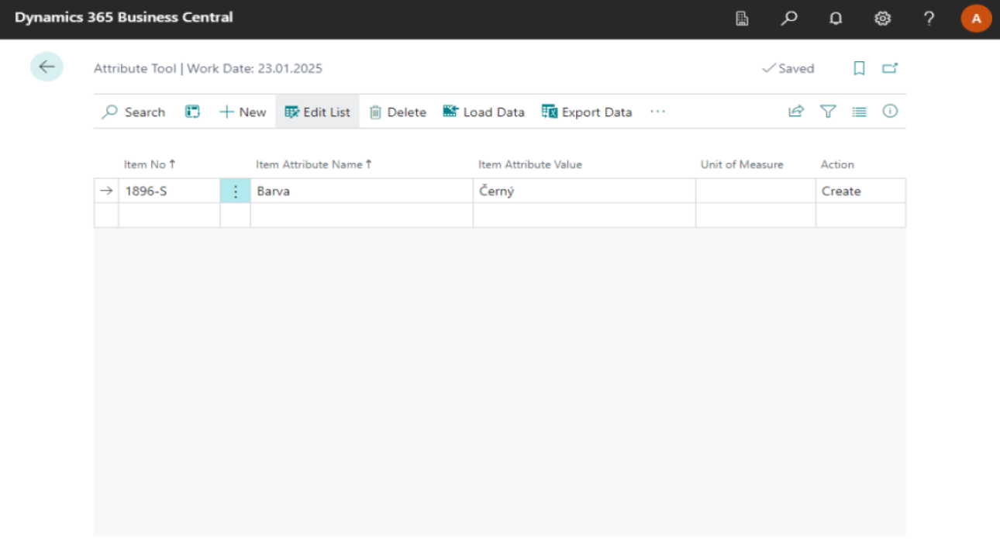
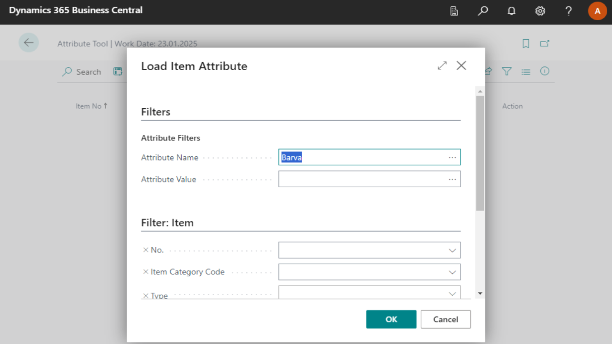
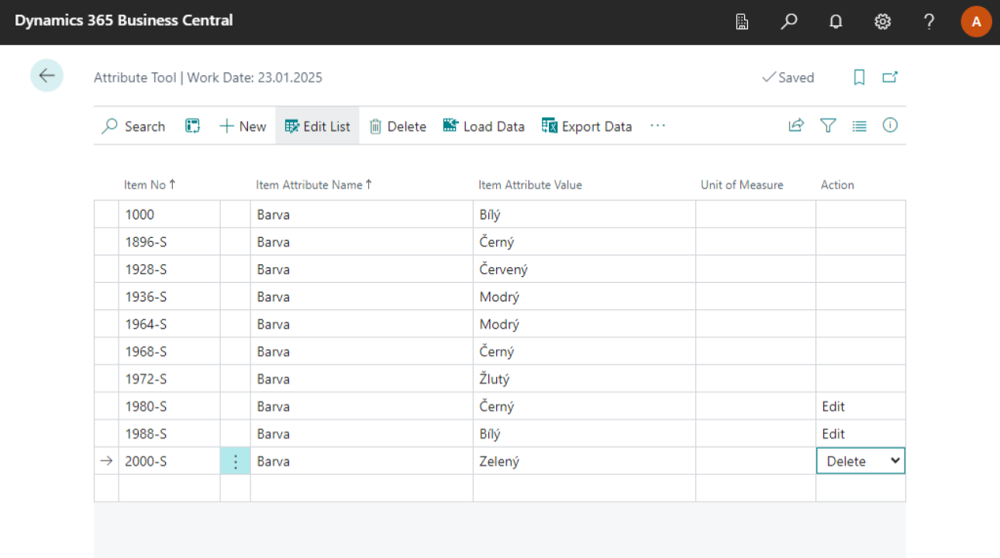
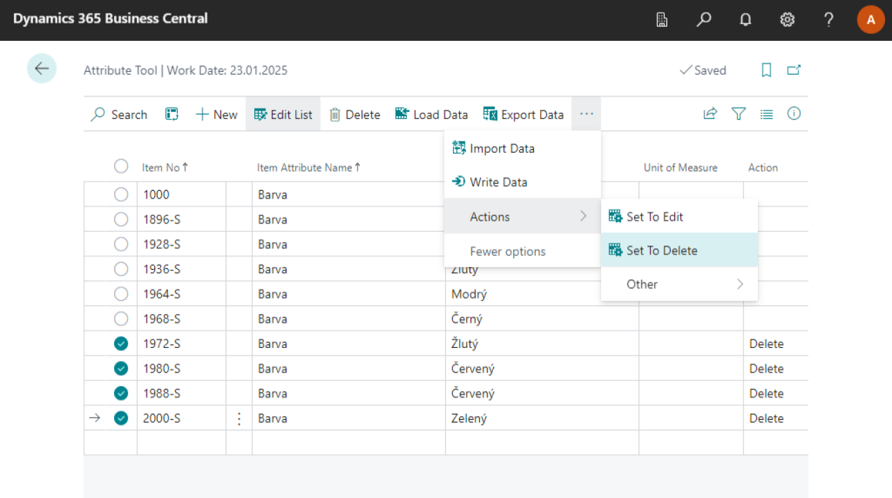
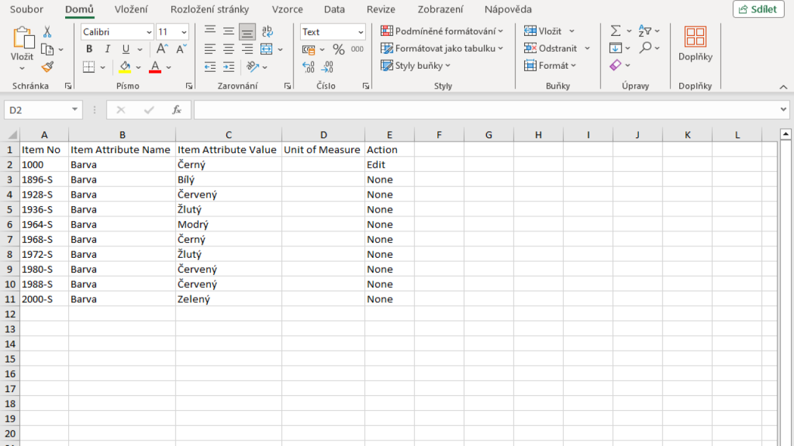
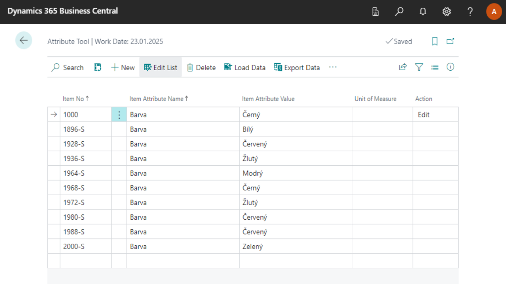

# Attribute Management

The **Attribute Tool** module is an extension for bulk work with product attributes so that the user does not have to enter product attributes for individual products, but can add, edit or delete them for all products on one page. The tool also includes export and import of attributes to an excel file

The functionality is available on the **Attribute Tool** page, from where individual functions for working with attributes are launched.

## Creating new attributes

1. Select the , type **Attribute Tool**, then select the associated link.
2. On the **Attribute Tool** page, select the **New** icon.
3. Enter the **Item Number**, **Attribute Name**, and **Attribute Value**.
4. The **Create** value is automatically added to the **Action** field.
5. Now select the **Write Data** icon.

To check, you can view the **Items** page and verify the attributes you have entered for the item.

## Edit existing attributes

Once attributes have been created, you can edit or delete attributes.
But first, you need to view the existing attributes as follows:

1. Select the  function, type **Attribute Tool**, and then select the associated link.
2. On the **Attribute Tool** page, select the **Load Data** icon and you can now filter which product attributes you want to load by product or attribute name.
3. Once filtered, click the **OK** button.

You can edit the displayed data as you wish. If you wish to change the value of a given item attribute, change the value in the **Attribute Value** field and the system will automatically change the value of the action field to **Edit**. If you wish to delete the attribute, change the value of the action field to **Delete**. Once you have made all the edits, select the **Write Data** icon to apply the changes to the item data.

> [!NOTE]
> Unless you select the **Write Data** icon, the data will remain unchanged. Loading data via the **Load Data** icon automatically overwrites data already written to the page and is not applied to the item attributes.

If you wish to delete multiple product attributes in bulk, click on **Three dots** next to one of the records and click **Select more**. This will allow you to select multiple records. Once you have selected all of the desired records, select the **Set to Delete** icon to set the action field value for the selected records to **Delete**. To apply the changes, select the **Write Data** icon again.

## Modifying attributes in Excel

Another option for editing attributes is using Excel.

Again, as in the previous section, you can filter and load the data in Business Central. You can export this data to an Excel file using the **Export Data** icon. Alternatively, you can give **Export Data** without filtering and loading the data first, giving you an excel file with a layout for attribute management.

In the Excel file, you can edit the values as needed and then click on the **Import Data** icon in Business Central and paste the Excel file there. Once pasted, the data will be displayed in Business Central. The value of the **Action** field will be determined by the value you entered in Excel. If you did not enter one, it will be adjusted according to the changes made to the attribute. For example, if you enter the item number and attribute name of an existing item attribute, but you enter a different value for the attribute than the one that is currently there, the field value will automatically be changed to **Edit**.

You can check and edit the imported data in this way. After checking, select the **Write Data** icon and the data will be overwritten to the item.

**See also**

[Working with Item Attributes](https://learn.microsoft.com/en-us/dynamics365/business-central/inventory-how-work-item-attributes)
